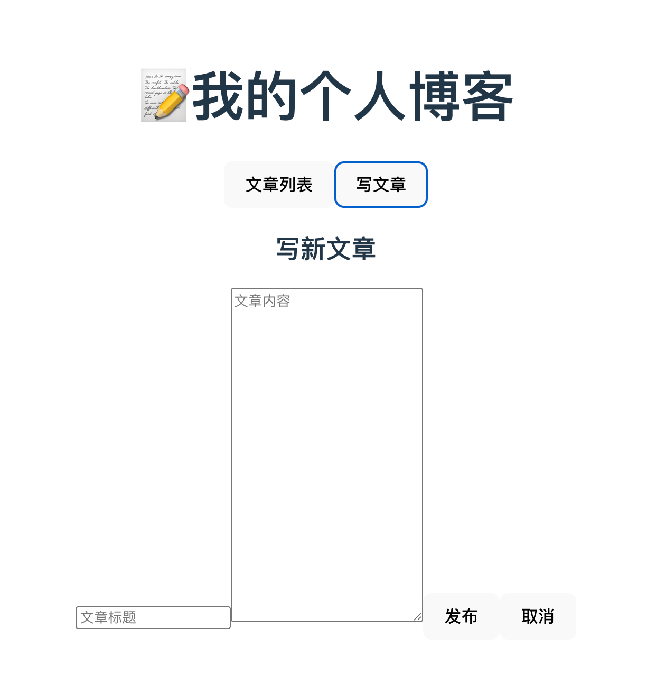
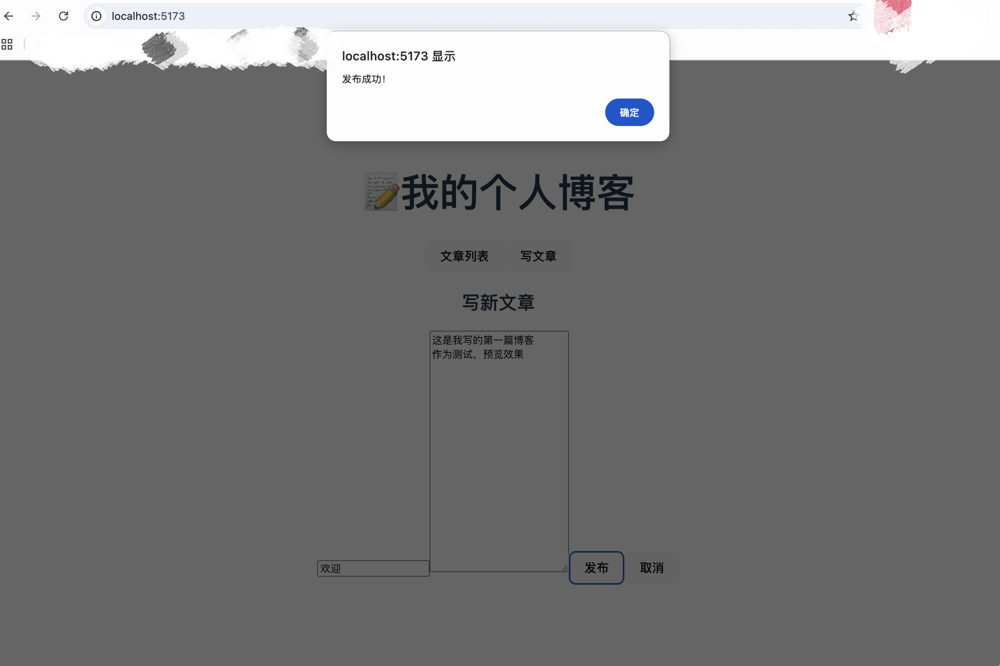
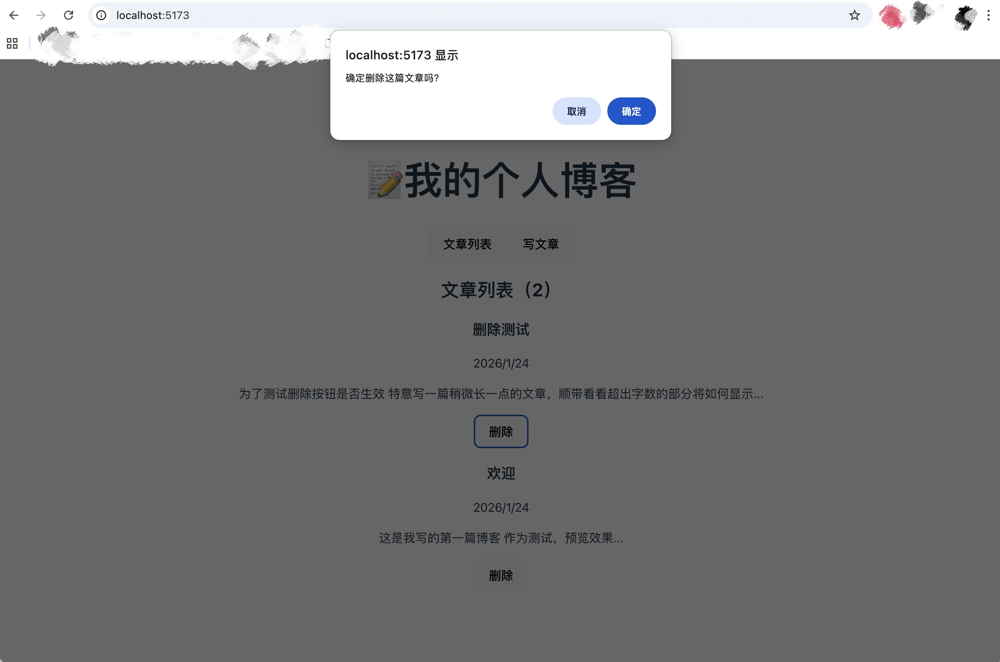

# 📝 Personal Blog

## 📝 项目简介

一个基于 React 开发的个人博客应用。支持文章发布、浏览、删除等功能，使用 React Router 实现单页面应用（SPA），并通过 ReactMarkdown 支持 Markdown 格式写作。

## 📸 项目预览

### 1. 文章列表视图
展示所有已发布的博客文章，包含日期及内容摘要。


---

### 2. 文章列表
完整的文章列表展示，支持点击查看详情。


---

### 3. Markdown 编辑器
支持实时输入标题与 Markdown 格式的内容，一键发布。



---

### 4. 发布成功提醒
文章成功同步至本地存储后，弹出即时反馈，告知用户操作已完成。



---

### 5. 安全删除确认
执行删除操作前触发二次确认弹窗，有效规避因误触导致的数据丢失。



## ✨ 主要功能

- 📰 **文章列表**：展示所有已发布的博客文章，包含标题、日期、作者和内容摘要
- ✍️ **写文章**：支持 Markdown 格式撰写文章
- 👀 **文章详情**：查看完整文章内容，Markdown 渲染显示
- 🗑️ **删除文章**：删除不需要的文章，带二次确认提示
- 🧭 **路由导航**：使用 React Router 实现页面切换，无需刷新
- ✅ **即时反馈**：发布成功后弹出提示，用户体验友好
- 💾 **数据持久化**：使用 localStorage 保存文章数据

## 🛠️ 技术栈

- **框架**：React (Hooks: useState, useEffect)
- **路由**：React Router v6 (BrowserRouter, Routes, Route, NavLink, useParams, useNavigate)
- **Markdown 渲染**：ReactMarkdown
- **数据存储**：localStorage
- **样式**：CSS3 (内联样式 + CSS Modules)

## 🌟 项目亮点

- ✅ **单页面应用（SPA）**：使用 React Router 实现流畅的页面切换
- ✅ **动态路由**：使用 useParams 实现文章详情页动态路由
- ✅ **编程式导航**：使用 useNavigate 实现发布后自动跳转
- ✅ **Markdown 支持**：支持 Markdown 语法写作，自动渲染
- ✅ **组件化开发**：页面组件清晰拆分（列表、写作、详情）
- ✅ **状态管理**：使用 React Hooks 管理全局文章状态
- ✅ **用户体验优化**：发布成功提示 + 删除二次确认
- ✅ **数据持久化**：刷新页面文章数据不丢失

## 📂 项目结构
```
personal_blog/
├── src/
│   ├── App.js          # 主应用组件，路由配置
│   ├── App.css         # 全局样式
│   ├── pages/          # 页面组件
│   │   ├── Home.js     # 文章列表页
│   │   ├── WritePost.js  # 写文章页
│   │   └── PostDetail.js # 文章详情页
│   └── index.js        # 入口文件
├── public/
└── package.json
```

## 🚀 快速开始

### 安装依赖
```bash
npm install
npm install react-router-dom react-markdown
```

### 启动项目
```bash
npm start
```

访问 http://localhost:3000

## 💡 核心功能实现

### 路由配置
```javascript
<BrowserRouter>
  <nav>
    <NavLink to="/">文章列表</NavLink>
    <NavLink to="/write">写文章</NavLink>
  </nav>
  
  <Routes>
    <Route path="/" element={<PostList />} />
    <Route path="/write" element={<WritePost />} />
    <Route path="/article/:id" element={<PostDetail />} />
  </Routes>
</BrowserRouter>
```

### 动态路由参数
```javascript
// 文章详情页使用 useParams 获取 ID
const { id } = useParams();
const post = posts.find(p => p.id === parseInt(id));
```

### 编程式导航
```javascript
// 发布文章后自动跳转到首页
const navigate = useNavigate();
const handlePublish = () => {
  onPublish(newPost);
  navigate("/");
  alert("发布成功！");
};
```

### 安全删除确认
```javascript
const handleDelete = (id) => {
  const confirmed = window.confirm("确定删除这篇文章吗？");
  if (confirmed) {
    setPosts(posts.filter(post => post.id !== id));
    alert("已删除");
  }
};
```

### Markdown 渲染
```javascript
import ReactMarkdown from 'react-markdown';

<ReactMarkdown>{post.content}</ReactMarkdown>
```

### 数据持久化
```javascript
useEffect(() => {
  localStorage.setItem("posts", JSON.stringify(posts));
}, [posts]);
```

## 🎨 界面特点

- 🎯 **清晰导航**：顶部导航栏，当前页面高亮显示
- 📱 **响应式布局**：适配不同设备
- 💅 **现代设计**：深色导航栏 + 卡片式文章列表
- ✨ **流畅交互**：页面切换和操作反馈流畅自然
- 🔔 **即时提醒**：成功/确认提示，用户体验友好

## 🔧 技术要点

### React Router v6 特性
- ✅ 使用 `<Routes>` 和 `<Route>` 代替旧版 `<Switch>`
- ✅ 使用 `element` prop 代替 `component` prop
- ✅ 使用 `useNavigate` 代替 `useHistory`
- ✅ 使用 `NavLink` 实现导航高亮

### 组件通信
- 父组件维护文章状态
- 通过 props 传递数据和回调函数
- 子组件通过回调函数更新父组件状态

## 📚 学习要点

这个项目是学习 **React Router** 的完整实战案例，涵盖了：
- 基础路由配置
- 动态路由（`:id` 参数）
- 编程式导航
- 路由导航高亮
- 单页面应用架构

## 👤 作者

**Lilyann**  
GitHub: [@Lilyann007](https://github.com/Lilyann007)

## 📄 License

MIT License